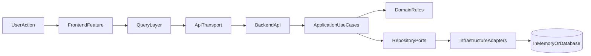

# Dead-Mans Architecture Overview

## Активный контур

В активной разработке участвуют только:

- `frontend/`
- `backend/`

`legacy-v1/` хранится как reference-only слой. Его можно читать для анализа UX и старой логики, но он не считается частью текущего продукта.

## Архитектурная схема



## Frontend

- `app/` содержит bootstrap, providers, theme и router wiring.
- `routes/` содержит route config и role-aware navigation helpers.
- `layouts/` содержит общие app-shell/layout компоненты.
- `features/` содержит feature-facing UI, hooks и data access.
- `shared/api/client/` содержит HTTP transport.
- `shared/api/contracts/` содержит generated transport types из OpenAPI и friendly aliases.
- `shared/api/mocks/` содержит mock adapters для локальной разработки.
- `locales/` содержит переводы по языкам.

Frontend-переключение между mock и HTTP идет через `VITE_API_MODE`, а не через изменения page-компонентов.

## Backend

- `Api/Contracts/` содержит HTTP DTO.
- `Api/Mapping/` содержит mapping application-моделей в transport DTO.
- `Application/` содержит use-case сервисы и repository ports.
- `Domain/` содержит доменные сущности и инварианты.
- `Infrastructure/` содержит adapters: in-memory storage для game-срезов, Twitch/EF persistence для auth и DI.
- `Controllers/` остаются тонкими и маппят application-модели в HTTP DTO.

In-memory слой больше не играет роль application-сервисов; он существует только как adapter хранения. При этом auth уже DB-backed через `ApplicationDbContext`, а game-срезы ещё на in-memory adapters.

## Контракты

Канонический source of truth для transport-моделей:

- `backend/openapi/deadmans.v1.yaml`

Frontend генерирует типы через:

```bash
npm --prefix frontend run generate:contracts
```

Это позволяет не поддерживать transport types в двух местах вручную.

Swagger UI в development ссылается на тот же `deadmans.v1.yaml`, чтобы документация и frontend contract generation смотрели в один и тот же transport source of truth.
